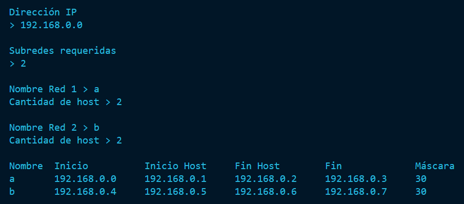

 

<h1 align="center">Calculadora de subredes IPv4 con Python 3</h1>

 

## ¿Cómo utilizarlo?

Lo puedes probar online directamente [aquí en Google Colab](https://colab.research.google.com/drive/1a5OlRedAqsMiu8HBiM_FtkHWuDj8EWcY?usp=sharing), o también puedes ejecutarlo de manera local siguiendo estos pasos:
1. Descargar [subnets.py](https://github.com/angeldavidhurtado/subnets/blob/main/subnets.py) del repositorio actual
2. En la terminal, dirígete a la ubicación donde guardaste subnets.py
3. Ejecuta `py subnets.py`

 

## Ejemplo de resultado esperado

 
